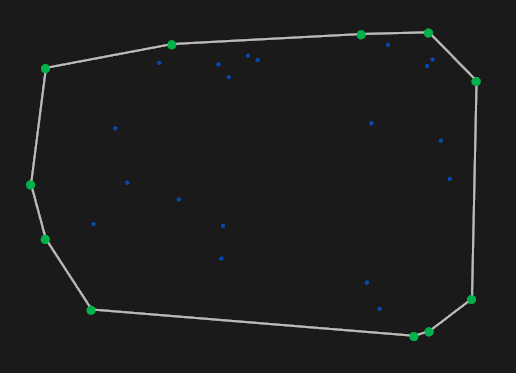

# Hull - Convex Hull in Rust



Simple project for computing the convex hull of a set of 2d pts, in Rust.
Uses the Piston graphics and game engine libraries to visualize the hull.

# Quickstart - TLDR

Clone the repository into your local directory of choice, and then run with:

```
cargo run --release
```

Make sure the `--release` flag is set, for greatest performance.

You can re-generate the points by pressing the R-key, and you can exit the
GUI using either the Escape-key or the Q-key.

# Robustness

The scope of this project was **not** to create a numerically-robust algorithm
for calculating the convex hull, so some rather egregious failures occur once 
the density of randomly generated points is set to a large enough value.

# TODOS

- Create a collinear condition for greater robustness/stability
- Re-implement comparison operation for greater robustness/stability
- Implement different convex hull algorithms
- Animate different convex hull algorithms
